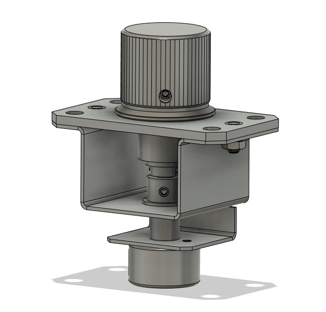

## Konami Volume Assembly

This is a full model of the Volume Assembly from a Sound Voltex Nemsys machine.

I've swapped the hardware and bushings out for items from McMaster, but part numbers for the official hardware can be found on the [GameRepair.info](https://gamerepair.info/parts/79_sound_voltex_volume_assembly) page.

Unfortunately, the small washer does not have a direct McMaster equivalent. I would probably use [this washer](https://www.mcmaster.com/91545A450/) with a few layers of scotch tape to shim the missing height.

In this fork I am modifying the readme to cater to someone who is trying to make 2 volume assemblies from scratch, if you for example, purchased an arcade panel that did not come with any.

As mentioned above in the original text, the STEP includes parts needed etc but I want to simplify it for people who don't use CAD software etc.

I've added a new .STEP that includes just the 4 parts that are not purchasable ( 1, 3, 5, 8 in the gamerepair doc). Remember to print 2 sets of them.

Worried that the STEP measurements for some of the parts aren't the same to the arcade.......for example the bushings bottom bushing should be 5mm long but this guy says 3mm long

1. VOLUME BASE

3D print this part. Volume Base v1.stp

2. BOTTOM BUSHING 

Oiles 80F-0803

https://yubiparts.com/collections/sound-voltex-knob-parts/products/oiles-80f-0603-80f-0803-bushings-for-sdvx-sound-voltex-arcade-knobs?variant=42846112841915

https://bluespringexpress.net/en-us/products/2x-sound-voltex-bushings-oiles-80f-0603-80f-0803?variant=43639918526714

https://www.mcmaster.com/2705T127/

You'll want 2x total

3. VOLUME SHAFT

3d print the shaft Volume Shaft v3.stp

φ1.6mm L12mm dowel (a)

https://www.mcmaster.com/91611A085/

2x M4x4 hex set screws (d) with "W point" cup and conical tips

https://www.mcmaster.com/91385A207/

4. TORQUE LIMITER

https://yubiparts.com/products/tok-tle1-618-5w-torque-limiters-for-sound-voltex-sdvx

https://bluespringexpress.net/en-us/products/sound-voltex-torque-limiter-tok-tle1-618-5w

5. VOLUME COVER ASSEMBLY

3d print this Volume Cover v3.stp

6. VOLUME KNOB
https://bluespringexpress.net/en-us/products/acknob

https://www.speedylabs.us/product/sound-voltex-aluminum-arcade-knob/

M4x5 hex set screws (c) with "W point" cup and conical tips

https://www.mcmaster.com/91385A208/

7. VOLUME ASSEMBLY

    https://www.sensatec.co.jp/e/products/detail.php?product_id=487
    
    http://www.e-metro.jp/quick/ELV-24.html
    
    https://www.sensatec.co.jp/e/products/detail.php?product_id=488

8. VOLUME COVER

3d print this Volume Bracket v1.stp

https://us.misumi-ec.com/vona2/detail/221000545065/?HissuCode=FNTS-SUS-M4 

https://www.mcmaster.com/96194A201/

9. TOP BUSHING

Oiles 80F-0603

https://www.mcmaster.com/2705T118/

https://yubiparts.com/products/oiles-80f-0603-80f-0803-bushings-for-sdvx-sound-voltex-arcade-knobs?variant=42846112841915

https://bluespringexpress.net/en-us/products/2x-sound-voltex-bushings-oiles-80f-0603-80f-0803

You'll want 2x total

10. WASHER

    Konami Part #115159030000, 2mm thick, 6mmID 10mmOD Nylon Washer
    
    Spaces the knob from the bracket so it doesn't rub, also acts as a tension fit component to keep the top bushing in place. Commonly misplaced when removing the knob.
    
https://yubiparts.com/products/misumi-wsjw10-6-2-resin-washers-2x-for-sound-voltex-sdvx

https://mobiuslau.github.io/sdvx/resources/
https://gamerepair.info/parts/79_sound_voltex_volume_assembly

